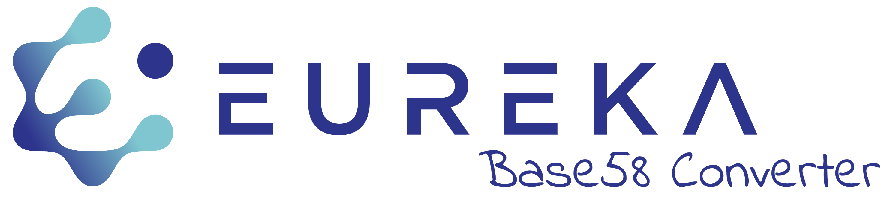

Implementation of a Base58-Converter for EUREKA (Ethereum-based) addresses.
This WebApp is able to encode and decode addresses within the EUREKA ecosystem using the Base58 Algorithm. 
> Base58 is a group of binary-to-text encoding schemes used to represent large integers as alphanumeric text, introduced by Satoshi Nakamoto for use with Bitcoin.
It has since been applied to other cryptocurrencies and applications. It is similar to Base64 but has been modified to avoid both non-alphanumeric characters and letters which might look ambiguous when printed.

In addition to that, EUREKA Encoding Algorithm adds well-known and recognizable prefix for making the addresses more compact and readable. 
## Demo
https://eureka-base58-converter.herokuapp.com/encoding

## EUREKA address design

Goals:
 * One goal for the address is to be as compact as possible.
 * To be easy recogizable
 * Avoid copy/paste error or typos (e.g. by using printable characters)

Thus, we propose the following:
 * printable and compact: base58 for the whole 32byte address
 * errors: checksum
 * recoginzable: prefix EKA

Example:
> [EKA192af1d185a829dedac13f58d051002dCC]

## Our Social Media
> Medium: https://medium.com/eureka-token/

> Twitter: https://twitter.com/TokenEureka/

> Facebook: https://www.facebook.com/TokenEureka/

> Instagram: https://www.instagram.com/tokeneureka/

> Linkedin: https://www.linkedin.com/company/eurekatoken/

## Website

> EUREKA token (EKA) description: https://eurekatoken.io

> Whitepaper: https://eurekatoken.io/whitepaper_3_1.pdf